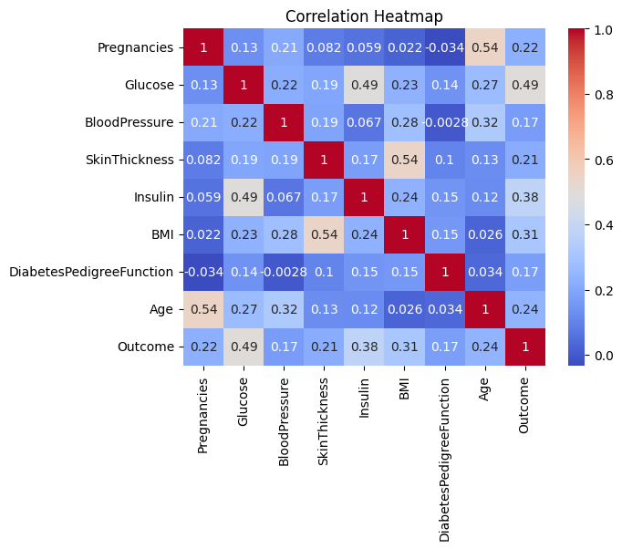
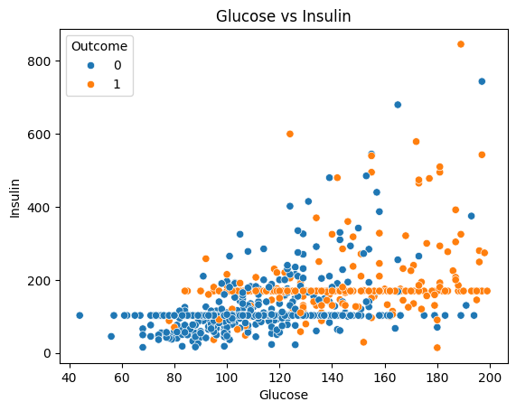
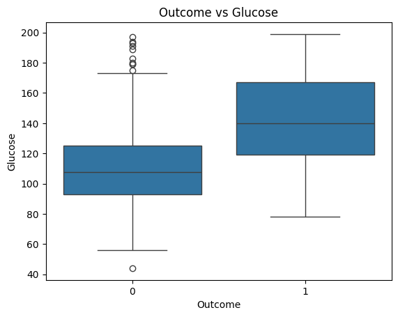

#  Diabetes Prediction - Exploratory Data Analysis (EDA)

---

##  Overview

Diabetes is one of the most common chronic diseases worldwide.  
This project performs **Exploratory Data Analysis (EDA)** on a medical dataset to uncover hidden patterns and understand key factors influencing diabetes.

The goal is to extract **data-driven insights** that can later be used for building a machine learning model.

---

##  Problem Statement

Analyze patient health data to identify key indicators that contribute to diabetes prediction.

---

##  Dataset Information

| Feature | Description |
|--------|-------------|
| Glucose | Plasma glucose concentration |
| Insulin | Serum insulin level |
| BMI | Body Mass Index |
| Blood Pressure | Diastolic blood pressure |
| Age | Age of patient |
| Outcome | 0 = Non-Diabetic, 1 = Diabetic |

---

##  Data Preprocessing

- Replaced invalid zero values in medical attributes  
- Handled missing / unrealistic physiological values  
- Ensured dataset consistency  
- Prepared data for visualization and analysis  

---

##  Exploratory Data Analysis

### Visualizations
- Distribution plots of features  
- Correlation heatmap  
- Outcome class distribution  
- Glucose vs Insulin analysis  
- BMI distribution analysis  

---

##  Key Insights

- Glucose is the strongest indicator of diabetes  
- Insulin levels vary significantly between diabetic and non-diabetic patients   
- Older age groups show higher diabetes prevalence  
- No single feature is sufficient

---

##  Correlation Analysis

- Strong positive correlation between **Glucose and Outcome**
- Moderate correlation with **BMI and Age**
- Weak correlation for Blood Pressure

---

##  Visualizations

### Correlation Heatmap

### Glucose vs Insulin Distribution

### Outcome vs Glucose Distribution

---

##  Conclusion

Glucose, BMI, Insulin, and Age are key indicators of diabetes.  
The dataset shows strong patterns that can be used for machine learning classification models.

---

##  Future Work

- Feature engineering  
- Machine Learning models:
  - Logistic Regression  
  - Random Forest  
  - XGBoost  
- Model evaluation  
- Deployment using Flask / Streamlit  

---

##  Tech Stack

- Python  
- Pandas  
- NumPy  
- Matplotlib  
- Seaborn  
- Jupyter Notebook  

---

##  Author

**Belinda Carol**  
Computer Science Student  
Aspiring Data Scientist | ML Enthusiast  
